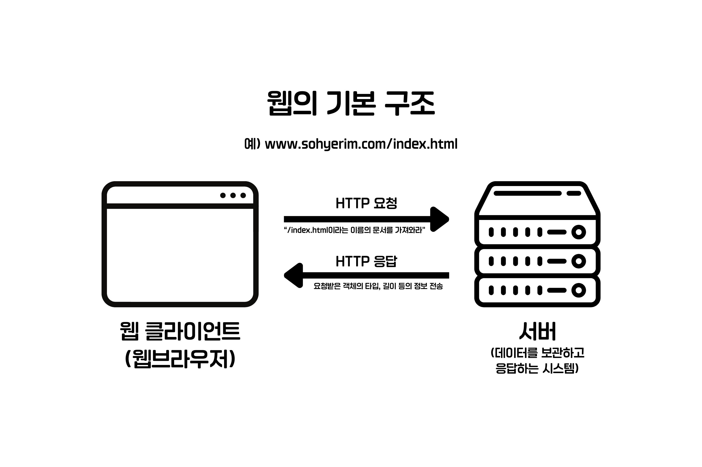

# HTTP 개관

## 1.1 HTTP: 인터넷의 멀티미디어 배달부

- 우리가 웹에서 접하는 거의 모든 데이터 형식을 HTTP가 전송해 준다.
- HTTP의 역할 : 인터넷 곳곳에 있는 *웹 서버*에서 정보를 가져와서 내 PC의 *브라우저*로 전달한다. 이로 인해 사용자는 웹에서 원하는 자료를 쉽게 확인할 수 있따.
- 신뢰성 있는 전송(TCP) : HTTP는 '신뢰성 있는 전송 프로토콜'을 사용하기 때문에, 데이터가 손상되거나 꼬이지 않는다. 이는 데이터 전송 중 손상, 중복, 왜곡 등을 신경 쓸 필요가 없기 때문에 개발자에게 이점을 준다.

## 1.2 웹 클라이언트와 서버

- 웹의 기본 구조는 클라이언트가 요청을 보내고 서버가 응답을 돌려주는 방식이다.
- 웹 브라우저와 같은 클라이언트는 서버에 저장된 데이터를 요청하고, 서버는 요청된 데이터를 찾아 응답한다.
  

## 1.3 리소스

- 웹서버가 리소스를 관리하고 제공한다.
- 리소스(resource) = 웹 서버가 관리하고 제공하는 웹 콘텐츠의 "원천"
- 정적 리소스: 서버에 그대로 저장된 파일들
  - 예) 텍스트, HTML, Word, PDF, 이미지, 동영상 등
- 동적 리소스 : 요청이 들어올 때마다 새로운 콘텐츠를 생성하는 프로그램
  - 예) 로그인한 사용자에 따라 다른 화면 제공, 현재 시각에 맞는 결과 출력, 라이브 카메라 영상, 주식 거래, DB 검색 등

### 1.3.1 미디어 타입

- HTTP는 전송되는 객체마다 MIME 타입이라는 데이터 포맷 라벨을 붙인다.
- MIME은 원래 이메일 시스템에서 파일 형식을 구분하기 위해 만들어졌으나, 웹에서도 채택되었다.
- 웹 서버는 객체를 보낼 때 MIME 타입을 포함하고, 웹 브라우저는 이를 통해 해당 객체를 어떻게 처리할지 결정한다.
- HTML, 이미지, 오디오, 동영상 등 브라우저는 다양한 타입을 직접 다루거나, 플러그인을 이용해 처리할 수 있다.
- MIME 타입은 '주 타입/부 타입' 구조로 되어 있다.
  - 예) HTML: `text/html`

### 1.3.2 **URI(Uniform Resource Identifier, 통합 자원 식별자)**

- 웹 리소스를 고유하게 식별하기 위한 이름표로, 클라이언트가 특정 리소스를 요청할 수 있게 해준다.

  - 예) 예: `http://www.joes-hardware.com/specials/saw-blade.gif`

  1. **URL(Uniform Resource Locator)** : URL의 가장 일반적인 형태로, 리소스의 위치와 접근 방법을 알려준다.

  - 구성 요소 :
    1. 스킴(Scheme): 리소스 접근 프로토콜 (예: `http://`, `https://`)
    2. 호스트(Host): 서버 주소 (예: `www.joes-harddware.com`)
    3. 경로(Path): 서버 내 리소스 위치 (예: `/specials/saw-blade.gif`)

  2. **URN(Uniform Resource Name)** : 리소스를 위치와 상관없이 고유하게 식별하는 이름.

  - 예: `urn:ietf:rfc:2131` (RFC2131 문서를 어디에 두든 동일하게 지칭 가능)
  - 아직 인프라 부족으로 널리 사용되지는 않지만, 미래에는 중요해질 전망

## 1.4 트랜잭션

- HTTP 트랜잭션은 클라이언트의 요청과 서버의 응답으로 이루어진다.
- 요청과 응답은 정형화된 **HTTP 메시지**를 통해 주고받는다.

### 1.4.1 HTTP 메서드 (요청)

- 요청 메시지 안에는 항상 하나의 메서드가 포함된다.
  - GET : 서버에게 지정한 리소스를 가져온다.
  - PUT : 클라이언트 데이터를 서버에 지정된 리소스로 저장된다.
  - DELETE : 서버에서 지정한 리소스를 삭제한다.
  - POST : 클라이언트 데이터를 서버 애플리케이션으로 보낸다.
  - HEAD : 리소스 본문은 제외하고, 헤더 정보만 가져온다.

### 1.4.2 HTTP 상태 코드 (응답)

- 응답 메시지에는 항상 세 자리 숫자의 상태 코드가 포함된다.
  - 200 OK : 성공, 문서가 정상 반환됨.
  - 302 Found : 리소스가 다른 곳으로 옮겨졌으니 거기로 가라(리다이렉트)
  - 404 Not Found : 요청한 리소스를 찾을 수 없음.
- 상태 코드 옆에는 사람이 읽기 쉬운 설명(reason phrase)이 붙지만, 실제 처리는 숫자로만 이뤄진다.

### 1.4.3 하나의 웹페이지 = 다수의 트랜잭션

- 웹페이지는 하나의 리소스가 아니라 여러 리소스의 집합이다.
- 브라우저는 HTML 문서를 먼저 가져오고, 그 안에 포함된 이미지, CSS, JS, 멀티키디어 등을 추가로 요청한다.
- 필요한 리소스는 서로 다른 서버에서 올 수도 있다.

## 1.5 HTTP 메시지

- HTTP 메시지는 텍스트 기반이며, 요청(Request)과 응답(Response) 두 종류뿐이다.
- 메시지 구조는 다음과 같다.
  1. 시작줄(Start line): 요청일 경우 동작을, 응답일 경우 결과를 표시한다.
  2. 헤더(Header fields): `이름: 값` 형태로 여러 줄 작성할 수 있으며, 빈 줄로 끝난다.
  3. 본문(Body): 선택적으로 포함되며, 텍스트나 이미지, 비디오 등 다양한 데이터가 들어갈 수 있다.

## 1.6 TCP 커넥션

- HTTP는 애플리케이션 계층 프로토콜로, 데이터 전송 세부사항은 TCP/IP에 의존한다.
- TCP는 다음을 보장한다.

  - 오류 없는 데이터 전송
  - 순서 보장 (보낸 순서 그대로 도착)
  - 끊김 없는 데이터 스트림 (임의 크기 데이터 전송 가능)

- TCP/IP는 인터넷의 핵심 프로토콜 집합으로, 다양한 네트워크와 하드웨어 환경을 추상화하여 안정적인 통신을 가능하게 한다.

- 계층 구조:

  - HTTP (애플리케이션 계층) → TCP (전송 계층) → IP (인터넷 계층)

- TCP 커넥션이 맺어지면, HTTP 메시지는 손실·손상·순서 꼬임 없이 안전하게 전달된다.

### 접속, IP 주소, 포트 번호

- HTTP 클라이언트가 서버와 통신하기 위해서는 IP 주소와 포트 번호를 이용해 TCP 커넥션을 맺어야 한다.
- IP 주소는 서버 컴퓨터를 식별하는 "전화번호"이고, 포트 번호는 서버 안에서 실행 중인 프로그램을 식별하는 "내선 번호"와 같다.
- URL은 서버의 호스트명(도메인)과 포트번호 정보를 제공하며, 호스트명은 DNS를 통해 IP 주소로 변환된다.
- HTTP 기본 포트 번호는 80이며, HTTPS는 443이다.

#### 웹브라우저의 접속 절차

1. URL에서 호스트명을 추출한다.
2. 호스트명을 DNS로 IP 주소로 변환한다.
3. URL에서 포트 번호를 추출한다. (없으면 기본값 사용)
4. 서버와 TCP 커넥션을 맺는다.
5. 브라우저가 서버에 HTTP 요청을 보낸다.
6. 서버가 HTTP 응답을 반환한다.
7. 커넥션이 종료되면, 브라우저가 문서를 화면에 표시한다.

## 프로토콜 버전

- HTTP/0.9 (1991): 프로토 타입, GET 메서드만 지원 / 헤더, MIME 타입, 버전 번호 없음 / 단순 HTML 문서 전송용
- HTTP/1.0 : 최초로 널리 쓰인 버전 / 버전 번호, 헤더, 다양한 메서드, 멀티미디어 지원 / 웹을 대중화한 핵심
- HTTP/1.0+ : 1990년대 중반, 업계가 자체적으로 확장 / keep-alive 연결, 가상 호스팅, 프락시 지원 추가 / 비공식 확장이지만 사실상 표준처럼 사용
- HTTP/1.1 : 구조적 결함 수정, 성능 최적화, 잘못된 기능 제거 / 복잡한 웹 애플리케이션 지원 / 현재까지 가장 널리 사용되는 버전
- HTTP/2.0 : 구글 SPDY 프로토콜 기반 / 멀티플렉싱, 헤더 압축, 서버 푸시 기능 / 1.1의 성능 문제를 해결하기 위해 설계됨

## 웹의 구성요소

- **프락시(Proxy)**: 클라이언트와 서버 사이에 위치한 HTTP 중개자.
- **캐시(Cache)**: 자주 찾는 웹페이지를 클라이언트 가까이에 저장해 두는 HTTP 저장소.
- **게이트웨이(Gateway)**: 클라이언트 요청을 다른 애플리케이션과 연결하는 특별한 웹 서버.
- **터널(Tunnel)**: HTTP 통신을 단순히 전달만 하는 특별한 프락시.
- **에이전트(Agent)**: 자동화된 HTTP 요청을 만드는 준지능적 웹 클라이언트 (예: 검색 엔진 크롤러).

### 프락시 (Proxy)

- 클라이언트와 서버 사이의 중개자
- 요청·응답을 대신 전달하거나 수정
- 주요 역할: 보안, 필터링 (바이러스 차단, 불건전 콘텐츠 차단 등)

### 캐시 (Cache)

- 캐시 프락시는 자주 요청되는 문서의 사본을 저장해 둔다.
- 다음 요청 시 원격 서버 대신 캐시에서 더 빠르게 응답 가능
- 장점: 성능 향상, 네트워크 트래픽 감소
- HTTP는 캐시가 항상 최신 상태를 유지하도록 규칙을 제공한다.

### 게이트웨이 (Gateway)

- 다른 서버와 연결되는 특별한 중개 서버
- HTTP 요청을 다른 프로토콜로 변환 (예: FTP)
- 클라이언트는 게이트웨이가 중개자임을 인식하지 못한다.

### 터널 (Tunnel)

- 데이터를 열어보지 않고 그대로 전달하는 HTTP 애플리케이션
- 주 용도: 비-HTTP 데이터 전송 (예: SSL 암호화 트래픽)
- 방화벽 환경에서 HTTPS를 통과시키는 데 활용된다.

### 에이전트 (Agent)

- 사용자를 대신해 HTTP 요청을 만드는 클라이언트 프로그램
- 예: 웹 브라우저(사용자 에이전트), 검색엔진 크롤러, 가격비교 로봇 등 자동화된 에이전트
